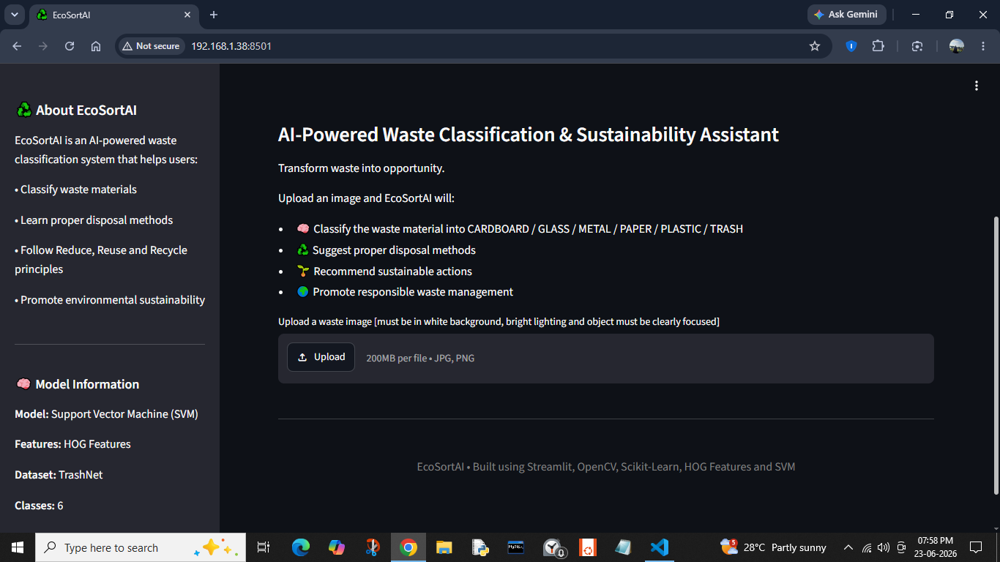

# ♻️ EcoSortAI

EcoSortAI is an AI-powered waste classification and sustainability recommendation system built using Computer Vision and Machine Learning. It classifies waste into different categories and promotes sustainable practices through Reduce, Reuse, and Recycle recommendations.

---

## Features

- Waste image classification
- HOG feature extraction
- Support Vector Machine (SVM)
- Confidence score prediction
- Environmental impact awareness
- Reduce, Reuse and Recycle recommendations
- Interactive Streamlit dashboard

---

## Tech Stack

- Python
- OpenCV
- Scikit-Learn
- Scikit-Image
- Streamlit
- NumPy
- Pillow
- Matplotlib
- Joblib

---

## Dataset

- TrashNet Dataset
- Classes:
  - Cardboard
  - Glass
  - Metal
  - Paper
  - Plastic
  - Trash

---

## Project Structure

```
EcoSortAI
│
├── app.py
├── requirements.txt
├── README.md
├── data/
├── model/
│     └── waste_classifier.joblib
├── notebooks/
├── screenshots/
└── venv/
```

---

## Model

The trained Support Vector Machine (SVM) model is included in this repository.

### Model Details

- Feature Extraction: Histogram of Oriented Gradients (HOG)
- Classifier: Support Vector Machine (SVM)
- Kernel: RBF
- Image Size: 128 × 128
- Accuracy: ~65%
- Model Format: Joblib (compressed)

**Model File:**

```
model/waste_classifier.joblib
```

---

## Screenshots

### Home Page

Main dashboard of EcoSortAI with sidebar information and upload section.




### Image Upload

Uploading a waste image for classification.


### Prediction Result

Predicted waste category along with confidence score.


### Sustainability Recommendations

#### Disposal


#### Reduce


#### Reuse


#### Recycle


---

## Live Demo

[EcoSortAI Streamlit App](https://ecosortaikp.streamlit.app/)

---

## Future Scope

- Improve accuracy using Deep Learning models
- Real-time camera detection
- Support for additional waste categories
- Mobile application development
- Smart waste management integration

---

## Author

**Krishnapooja P Pai**

B.Tech CSE (AI & ML)

---
