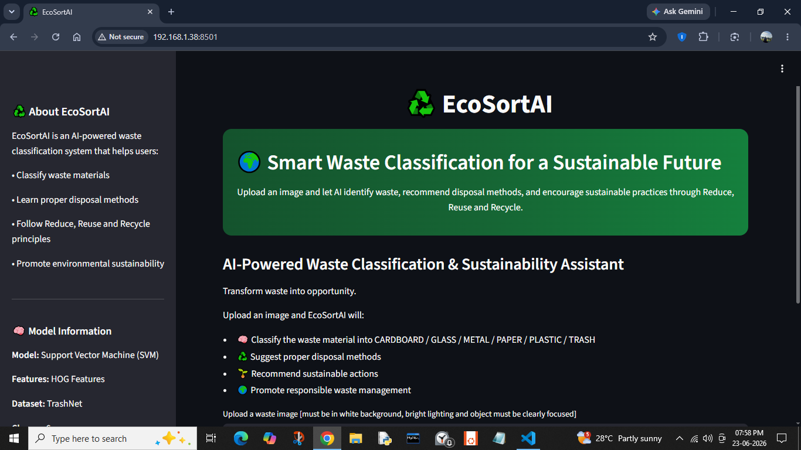
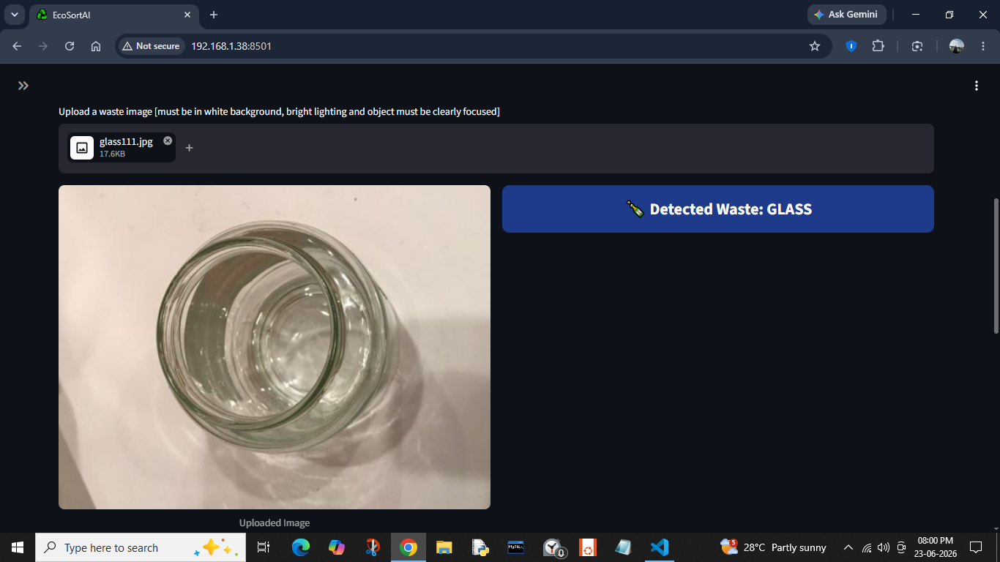
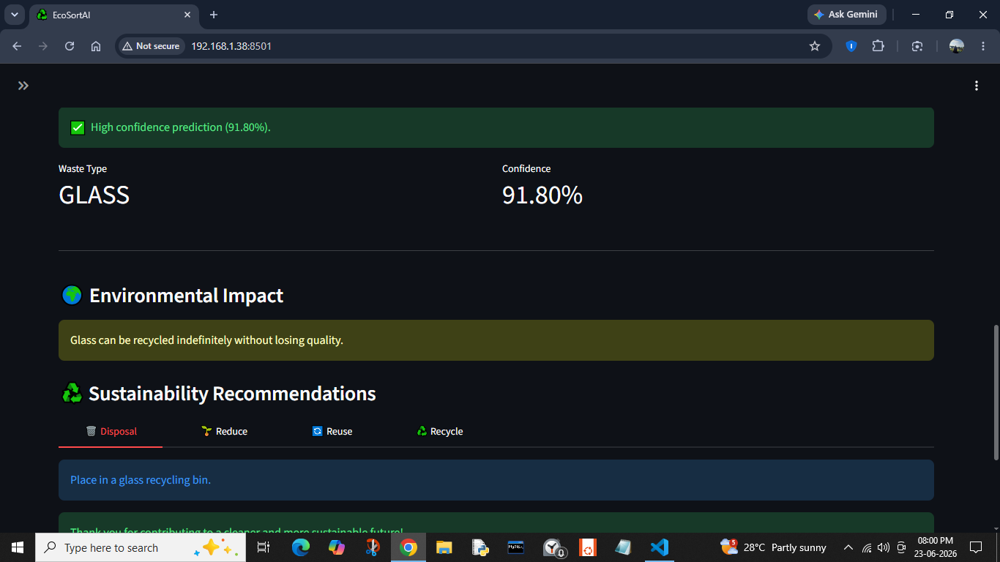
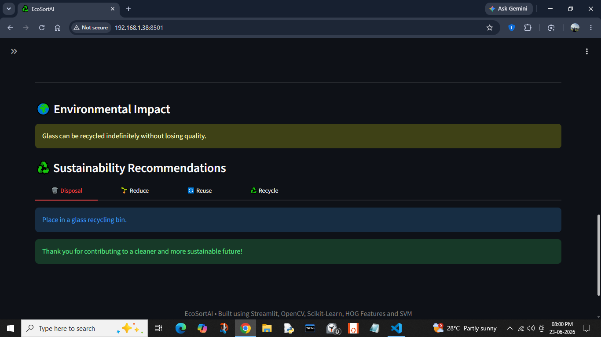
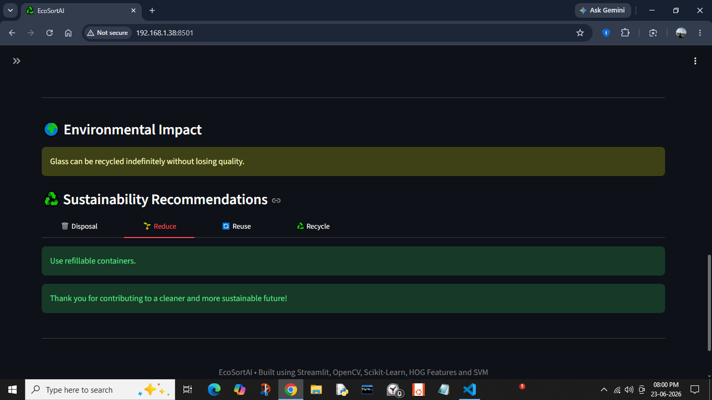
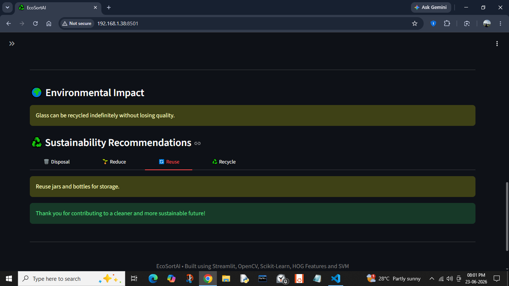
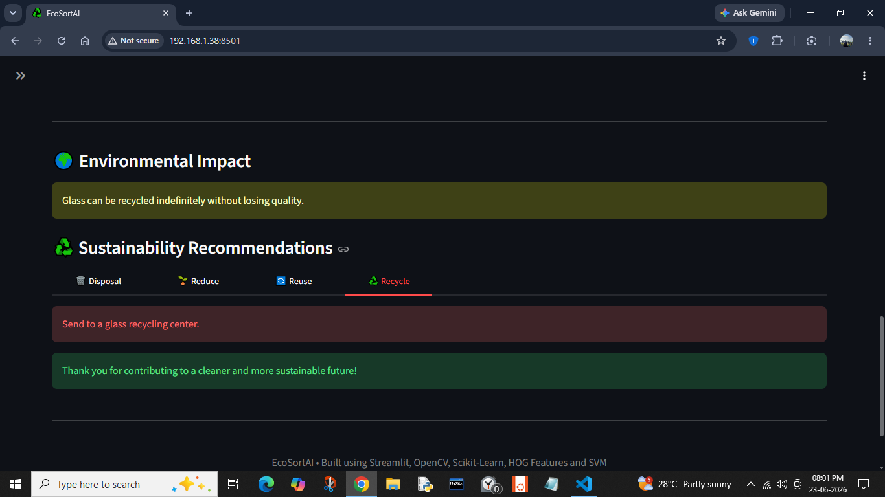

# ♻️ EcoSortAI

EcoSortAI is an AI-powered waste classification and sustainability recommendation system built using Computer Vision and Machine Learning.

## Features

- Waste image classification
- HOG feature extraction
- Support Vector Machine (SVM)
- Environmental impact awareness
- Reduce, Reuse and Recycle recommendations
- Interactive Streamlit dashboard

## Tech Stack

- Python
- OpenCV
- Scikit-Learn
- Scikit-Image
- Streamlit
- NumPy
- Pillow
- Matplotlib

## Dataset

- TrashNet Dataset

## Project Structure

EcoSortAI/
│
├── app.py
├── requirements.txt
├── README.md
├── model/
│   └── waste_classifier.pkl
├── notebooks/
│   ├── dataset_exploration.ipynb
│   └── svm_model.ipynb
└── screenshots/

## Future Scope

- Deep Learning-based classification
- Real-time camera detection
- More waste categories
- Mobile application support

## 📸 Screenshots

### 🏠 Home Page

Main dashboard of EcoSortAI with sidebar information and upload section.

### 📤 Image Upload

Uploading a waste image for classification.

### 🔍 Prediction Result

Predicted waste category along with confidence score.

### ♻️ Sustainability Recommendations

#### 🗑️ Disposal

#### 🌱 Reduce

#### 🔄 Reuse

#### ♻️ Recycle

## Model

The trained SVM model is not included because it exceeds GitHub's file size limit.

Run the notebook `notebooks/svm_model.ipynb` to retrain the model and generate:
model/waste_classifier.pkl